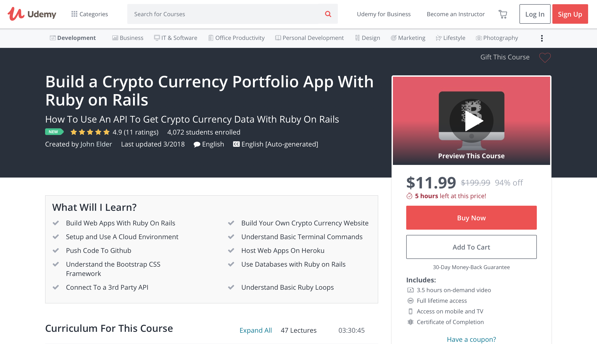

# Crypto Currency App

Congratulations! You're well on your way to becoming a software developer. One of the most valuable skills for any software developer is **resourcefulness**. Throughout your career, you will be presented with problems for which you likely won't have an answer right away. It is up to you to learn the necessary skills and find relevant resources to solve these problems within time and budget constraints.

**So here's your next challenge:**

*You are interviewing for a junior dev role at a cryptocurrency startup called TLHCoin. You made it to the final round and need to complete only one more step to get hired. You are asked to develop a web app that tracks the value of cryptocurrencies and have only ONE WEEK to do so.*

Yikes, that sounds pretty challenging. But no worries, you have been equipped to knock this out of the park! Let's see how we can go about solving this challenge.

First, let's rewrite the challenge in terms of action items (i.e. the things you have to do to successfully pass this challenge):
1. I need to have a good enough understanding of cryptocurrencies (you may or may not have this already).
1. I somehow need to get information regarding cryptocurrency values into my app. How can I get this third-party data into my app?
1. I need to develop a Ruby on Rails app (tip: always use what you know best unless the challenge specifies a language) to display the value of cryptocurrencies.

### What are Cryptocurrencies?

Our first action item is to **understand enough** about cryptocurrencies to be able to build an app for it. If this is your first time seeing the term, Google it and read a few of the articles on the first page. You likely have heard of the term Bitcoin. How are they related?

A great resource to learn about cryptocurrencies is (hint: read it): https://cryptominded.com/starters-guide-cryptocurrencies/

### How can I get the value of cryptocurrencies in my app?

Let's rephrase the question: "Is there a database somewhere that has the values of cryptocurrencies?" If we want to access someone else's data in a legal and appropriate way, we need an interface between our app and theirs. If you're thinking about using an API, you are absolutely right. So we can rephrase the question again: "Is there an API that can provide my app with the values of cryptocurrencies?"

Try Googling "cryptocurrency API". You will likely find several results, including:
* https://www.coinapi.io
* https://coinmarketcap.com/api/

Read through these sites and see if they can provide you with the data needed for your app.

### How can I develop a Ruby on Rails app to display the value of cryptocurrencies?

By now you know how to build a Ruby on Rails app. However, imagine if the challenge specified the app had to be build with Python and Django. If you are not familiar with the Python language and Django web framework, you would have to quickly learn it. A strong quality of any developer is the ability to learn quickly.

Fortunately, the challenge didn't specify a language or framework so you are free to choose. Thus, it makes sense to build the app with Ruby on Rails.

A great resource to quickly learn something new is Udemy. Udemy offers affordable courses for a variety of topics, including programming.

Go to https://www.udemy.com and search for "cryptocurrency rails app". You will be presented with several pages of online courses. Finding the right resource to quickly learn something new is actually an art. Since you are trying to learn something new, you may not have the domain expertise to identify the right resource. In addition, there are an infinite amount of resources to learn online. Over time, you'll get better at finding the right learning materials. For now, we're here to help.

To successfully complete the challenge, go through the following course on Udemy: https://www.udemy.com/build-a-crypto-currency-portfolio-app-with-ruby-on-rails/

In order to get the best discount on Udemy, open up your browser in **Incognito** mode. Copy and paste the URL. You should see a price between $11.99 and $19.99 (varies by day and time). Add it to cart, create an account (or signin if you already have one) and pay for the course. Note: DO NOT PAY FULL PRICE FOR ANYTHING ON UDEMY (there are always coupons and discounts).

**You have one week to complete the course, which will show you exactly how to solve the challenge. Make sure to upload your solution to GitHub before the deadline.**
