## **Phase 1**
In this tutorial, you will learn how to build your very own website using HTML, CSS and Bootstrap. In part 1 of this tutorial, we will build the site with just HTML. It won't be pretty, but it will work. In part 2, we will refactor our site by adding CSS to improve the appearance and layout. In part 3, we will demonstrate how the Bootstrap framework allows us to quickly build an awesome responsive site.

Throughout this example, we will build a portfolio website. The site requirements are as follows:
* A profile image of yourself  
* A short bio of yourself  
* Social and contact links (LinkedIn, Github, Email)   
* [Bonus] Projects (link out to your projects whether they are live or on Github)

### Part 1 - HTML

Let's get started with setting up our project:
1. In your `projects` folder, create a new folder: `$ mkdir portfolio_site`
1. `cd` into your `portfolio_site` directory
1. Create your first HTML file: `$ touch index.html`
1. Open the `index.html` file in your Codio text editor by selecting it in the Filetree. You are now ready to write some HTML!

There are several elements an HTML document should have to be considered valid HTML. To help you get started, copy-paste the following **HTML Starter Template** into `index.html`:

```html
<!DOCTYPE html>
<html lang="en">
  <head>
    <meta charset="utf-8" />
    <meta name="viewport" content="width=device-width, initial-scale=1, shrink-to-fit=no"> <!-- responsive viewport meta tag -->

    <!-- Update your website title -->
    <title>My Website</title>

    <!-- Link Bootstrap CSS here -->

    <!-- Link custom CSS here -->
  </head>
  <body>
    <!-- Add your content here -->

    <!-- At the end of all your content, add Bootstrap JS here -->
  </body>
</html>
```

Before we add content, let's make sure everything is working with a **Hello World** example. Add `<h1>Hello World</h1>` to `<body>`:

```html
...
  <body>
    <!-- Add your content here -->
    <h1>Hello World</h1>

    <!-- At the end of all your content, add Bootstrap JS here -->
  </body>
...
```

In order to test this HTML, go to your Codio Filetree and right-click on `index.html`. Select `Preview static`. A browser-like window will open in a new tab and you should see your webpage. Currently the page should only display Hello World. Anytime you add some new HTML, you can refresh this page to see the result.

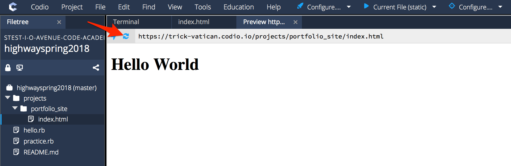

#### Add Your Name

We are now ready to add content to our personal site. Update your site title to display your first and last name: `<title>Ryan Kopinsky</title>`. Also add an `h1` tag to display your name on the page: `<h1>Ryan Kopinsky</h1>`. Your `index.html` should look like:

```html
<!DOCTYPE html>
<html lang="en">
  <head>
    <meta charset="utf-8" />
    <meta name="viewport" content="width=device-width, initial-scale=1, shrink-to-fit=no"> <!-- responsive viewport meta tag -->

    <!-- Update your website title -->
    <title>Ryan Kopinsky</title>

    <!-- Link Bootstrap CSS here -->

    <!-- Link custom CSS here -->
  </head>
  <body>
    <!-- Add your content here -->
    <h1>Ryan Kopinsky</h1>

    <!-- At the end of all your content, add Bootstrap JS here -->
  </body>
</html>
```

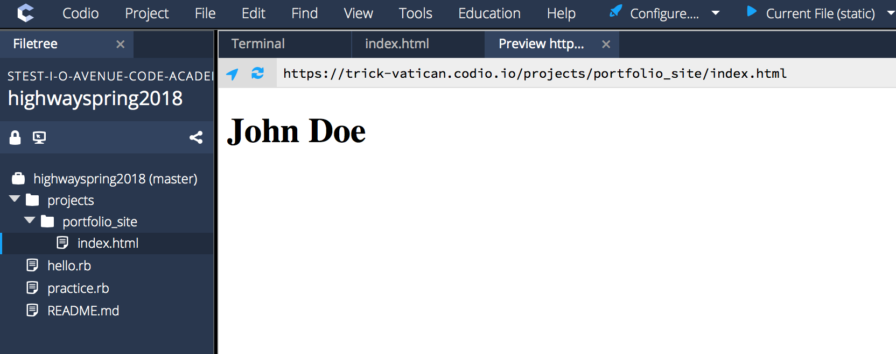

#### Add Your Headshot

Let's continue adding content. As per the site requirements, we should now add a professional headshot. We can add an image by doing the following:
1. In your `portfolio_site` folder, create a new folder called `images`: `$ mkdir images`.
1. Upload your professional headshot (in either .PNG or .JPG format) by right-clicking on the newly-created `images` folder. Select `Upload` and use the dialog to upload your image.
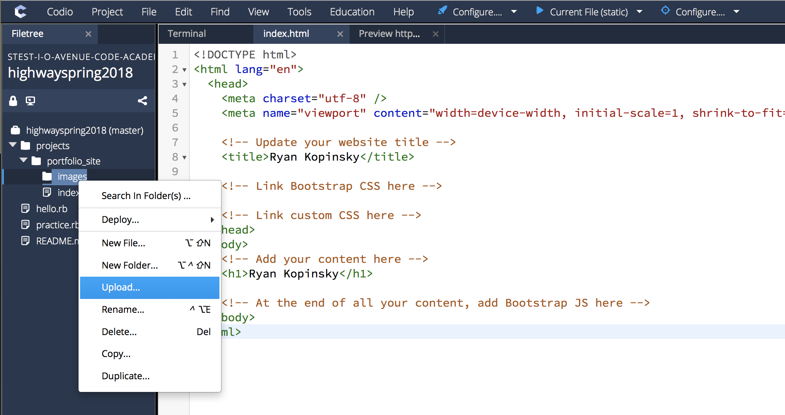
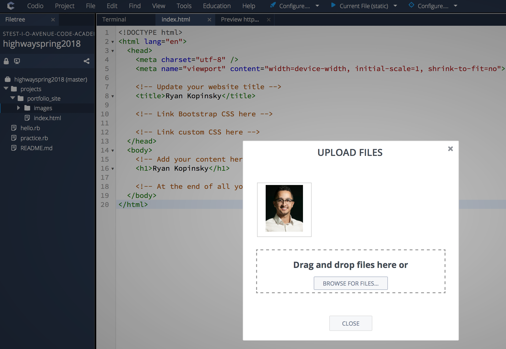
1. Use an `img` tag to place the image on the webpage: ``.

Your `index.html` should look like:

```html
<!DOCTYPE html>
<html lang="en">
  <head>
    <meta charset="utf-8" />
    <meta name="viewport" content="width=device-width, initial-scale=1, shrink-to-fit=no"> <!-- responsive viewport meta tag -->

    <!-- Update your website title -->
    <title>Ryan Kopinsky</title>

    <!-- Link Bootstrap CSS here -->

    <!-- Link custom CSS here -->
  </head>
  <body>
    <!-- Add your content here -->
    <h1>Ryan Kopinsky</h1>

    

    <!-- At the end of all your content, add Bootstrap JS here -->
  </body>
</html>
```

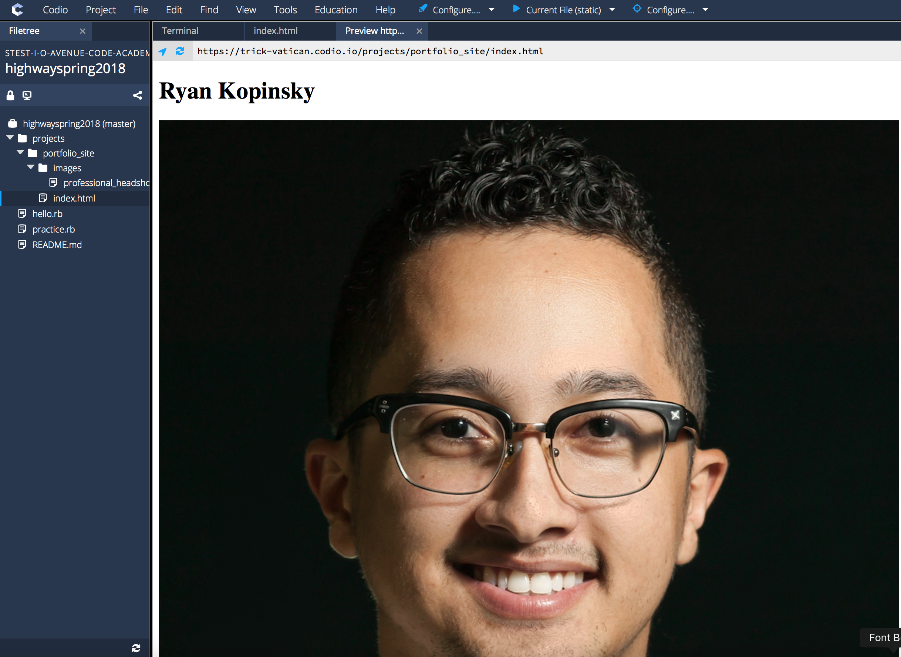

Oops! That image is way too big (the original image is 1000px wide and 1250px high). We can constrain its size by providing a `height` and/or `width` attribute. It is important to note that you always want to maintain the image's aspect ratio (so it doesn't looked squished). Thus, when providing size constraints, provide either a value for `height` or `width`. The other value will automatically be calculated for you to maintain the image's aspect ratio: ``.

Your `index.html` should look like:

```html
<!DOCTYPE html>
<html lang="en">
  <head>
    <meta charset="utf-8" />
    <meta name="viewport" content="width=device-width, initial-scale=1, shrink-to-fit=no"> <!-- responsive viewport meta tag -->

    <!-- Update your website title -->
    <title>Ryan Kopinsky</title>

    <!-- Link Bootstrap CSS here -->

    <!-- Link custom CSS here -->
  </head>
  <body>
    <!-- Add your content here -->
    <h1>Ryan Kopinsky</h1>

    

    <!-- At the end of all your content, add Bootstrap JS here -->
  </body>
</html>
```

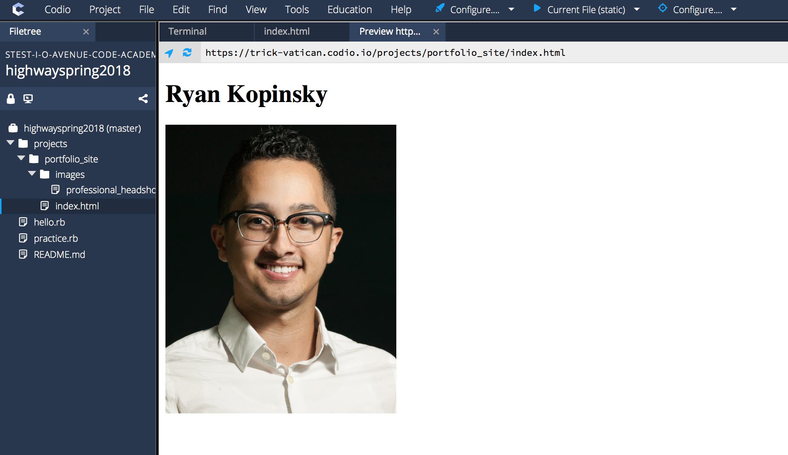

Much better!

#### Add Your Short Bio

Your bio should tell the story of you. Who are you, what is your background, what are your (technical) skills, what are your goals and interests etc.

For phase 1 of your personal site, write 1 to 2 short paragraphs for your bio. This tutorial will use sample text generated at https://www.lipsum.com. You should use your actual bio!

You can add your bio content as paragraph text using the `p` tag. Your `index.html` should look like:

```html
<!DOCTYPE html>
<html lang="en">
  <head>
    <meta charset="utf-8" />
    <meta name="viewport" content="width=device-width, initial-scale=1, shrink-to-fit=no"> <!-- responsive viewport meta tag -->

    <!-- Update your website title -->
    <title>Ryan Kopinsky</title>

    <!-- Link Bootstrap CSS here -->

    <!-- Link custom CSS here -->
  </head>
  <body>
    <!-- Add your content here -->
    <h1>Ryan Kopinsky</h1>

    

    <p>Lorem ipsum dolor sit amet, consectetur adipiscing elit. Vestibulum sollicitudin gravida tellus, in mattis magna. Donec non leo quis tellus tempus consectetur. Quisque ultricies lectus varius velit ultricies facilisis ut placerat nulla. In est nibh, malesuada a varius non, suscipit sed leo. Sed commodo laoreet commodo. Phasellus ac velit fermentum, convallis augue non, tempus magna.</p>

    <p>In vel velit metus. Vestibulum non nisi lacinia, ullamcorper justo rutrum, luctus erat. Curabitur pellentesque bibendum pulvinar. Duis porttitor bibendum hendrerit. Praesent commodo ex sit amet tortor placerat imperdiet. Pellentesque in volutpat risus. Nam vitae gravida urna. Aenean eu nisi ut velit pharetra efficitur.</p>

    <!-- At the end of all your content, add Bootstrap JS here -->
  </body>
</html>
```

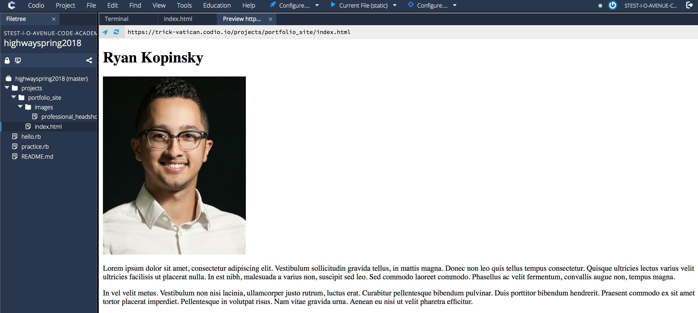

#### Add Social and Contact Links

Now it's time to add social and contact links so people can reach out to us! In this tutorial, we will add links to LinkedIn, Github, and Email. You are free to add more, as appropriate:
1. Add an `a` tag with a link to your LinkedIn profile URL: `<a href="https://www.linkedin.com/in/ryankopinsky/" target="_blank">LinkedIn</a>`
1. Add an `a` tag with a link to your GitHub profile URL: `<a href="https://github.com/ryankopinsky" target="_blank">GitHub</a>`
1. Add an `a` tag with a `mailto:` link to your Email Address: `<a href="mailto:ryan@ioavenue.com">Email</a>`

Note: `target="_blank"` instructs the browser to open the link in a new tab.

Your `index.html` should look like:

```html
<!DOCTYPE html>
<html lang="en">
  <head>
    <meta charset="utf-8" />
    <meta name="viewport" content="width=device-width, initial-scale=1, shrink-to-fit=no"> <!-- responsive viewport meta tag -->

    <!-- Update your website title -->
    <title>Ryan Kopinsky</title>

    <!-- Link Bootstrap CSS here -->

    <!-- Link custom CSS here -->
  </head>
  <body>
    <!-- Add your content here -->
    <h1>Ryan Kopinsky</h1>

    

    <p>Lorem ipsum dolor sit amet, consectetur adipiscing elit. Vestibulum sollicitudin gravida tellus, in mattis magna. Donec non leo quis tellus tempus consectetur. Quisque ultricies lectus varius velit ultricies facilisis ut placerat nulla. In est nibh, malesuada a varius non, suscipit sed leo. Sed commodo laoreet commodo. Phasellus ac velit fermentum, convallis augue non, tempus magna.</p>

    <p>In vel velit metus. Vestibulum non nisi lacinia, ullamcorper justo rutrum, luctus erat. Curabitur pellentesque bibendum pulvinar. Duis porttitor bibendum hendrerit. Praesent commodo ex sit amet tortor placerat imperdiet. Pellentesque in volutpat risus. Nam vitae gravida urna. Aenean eu nisi ut velit pharetra efficitur.</p>

    <a href="https://www.linkedin.com/in/ryankopinsky/" target="_blank">LinkedIn</a>
    <a href="https://github.com/ryankopinsky" target="_blank">GitHub</a>
    <a href="mailto:ryan@ioavenue.com">Email</a>

    <!-- At the end of all your content, add Bootstrap JS here -->
  </body>
</html>
```

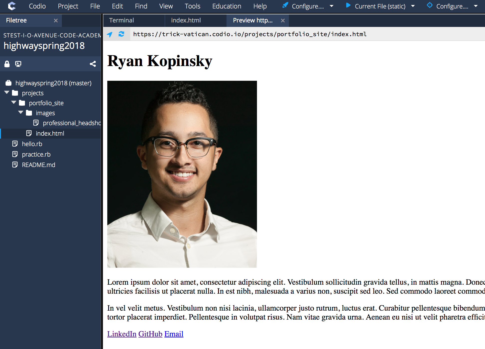

#### Wrapping Up

We now have all the content and HTML for phase 1 of our portfolio site. To close out the HTML part of this tutorial, let's refactor our `index.html` file as follows:


```html
<!DOCTYPE html>
<html lang="en">
  <head>
    <meta charset="utf-8" />
    <meta name="viewport" content="width=device-width, initial-scale=1, shrink-to-fit=no"> <!-- responsive viewport meta tag -->

    <!-- Update your website title -->
    <title>Ryan Kopinsky</title>

    <!-- Link Bootstrap CSS here -->

    <!-- Link custom CSS here -->
  </head>
  <body>
    <!-- Add your content here -->
    <h1>Ryan Kopinsky</h1>

    <!-- Headshot -->
    

    <!-- Short Bio -->
    <p>Lorem ipsum dolor sit amet, consectetur adipiscing elit. Vestibulum sollicitudin gravida tellus, in mattis magna. Donec non leo quis tellus tempus consectetur. Quisque ultricies lectus varius velit ultricies facilisis ut placerat nulla. In est nibh, malesuada a varius non, suscipit sed leo. Sed commodo laoreet commodo. Phasellus ac velit fermentum, convallis augue non, tempus magna.</p>

    <p>In vel velit metus. Vestibulum non nisi lacinia, ullamcorper justo rutrum, luctus erat. Curabitur pellentesque bibendum pulvinar. Duis porttitor bibendum hendrerit. Praesent commodo ex sit amet tortor placerat imperdiet. Pellentesque in volutpat risus. Nam vitae gravida urna. Aenean eu nisi ut velit pharetra efficitur.</p>

    <!-- Social and Contact Links -->
    <a href="https://www.linkedin.com/in/ryankopinsky/" target="_blank">LinkedIn</a>
    <a href="https://github.com/ryankopinsky" target="_blank">GitHub</a>
    <a href="mailto:ryan@ioavenue.com">Email</a>

    <!-- At the end of all your content, add Bootstrap JS here -->
  </body>
</html>
```

For documentation purposes, we added 3 comments:
1. `<!-- Headshot -->`
1. `<!-- Short Bio -->`
1. `<!-- Social and Contact Links -->`

We are now done with **Part 1 - HTML**.

---

### Part 2 - CSS

In this part of the tutorial, we will use CSS to improve the appearance and layout of our website. Obviously, there is no set way to style your website. However, for this tutorial we will give it some basic styling. You are free to enhance it as you see fit.

We will style our website as follows:
1. Margins: add margins to the body so it's not so close to the edge.
1. Sizing: refactor your headshot such that its size is determined by CSS as opposed to an HTML attribute.
1. Layout: position bio and social links next to the headshot.
1. Fonts: give your name a color and increase the font size of the bio text.

#### Setting Up CSS Stylesheet

Before we can apply styles to our HTML elements, we need to create a CSS file and link to it in our HTML file:
1. In `portfolio_site`, create a new folder: `$ mkdir css`
1. Create your CSS file: `$ touch css/custom.css`
1. To make sure we have done everything correctly, let's write some test CSS in our `custom.css` file:
```CSS
h1 {
    color: red;
}
```
1. Refresh your webpage to see if all our `h1` headers are now red (in this case our name). It seems like nothing happened. We created our CSS file and added a style; however, **we did not link to our CSS in our HTML file**. It doesn't matter how experienced you are as a web developer, you will likely make this mistake at least once. So let's fix it.
1. Add a link to our CSS stylesheet: `<link rel="stylesheet" type="text/css" href="css/custom.css">`. Refresh your webpage and you should now see your name in red.

Your `index.html` should look like:

```html
<!DOCTYPE html>
<html lang="en">
  <head>
    <meta charset="utf-8" />
    <meta name="viewport" content="width=device-width, initial-scale=1, shrink-to-fit=no"> <!-- responsive viewport meta tag -->

    <!-- Update your website title -->
    <title>Ryan Kopinsky</title>

    <!-- Link Bootstrap CSS here -->

    <!-- Link custom CSS here -->
    <link rel="stylesheet" type="text/css" href="css/custom.css">
  </head>
  <body>
    <!-- Add your content here -->
    <h1>Ryan Kopinsky</h1>

    <!-- Headshot -->
    

    <!-- Short Bio -->
    <p>Lorem ipsum dolor sit amet, consectetur adipiscing elit. Vestibulum sollicitudin gravida tellus, in mattis magna. Donec non leo quis tellus tempus consectetur. Quisque ultricies lectus varius velit ultricies facilisis ut placerat nulla. In est nibh, malesuada a varius non, suscipit sed leo. Sed commodo laoreet commodo. Phasellus ac velit fermentum, convallis augue non, tempus magna.</p>

    <p>In vel velit metus. Vestibulum non nisi lacinia, ullamcorper justo rutrum, luctus erat. Curabitur pellentesque bibendum pulvinar. Duis porttitor bibendum hendrerit. Praesent commodo ex sit amet tortor placerat imperdiet. Pellentesque in volutpat risus. Nam vitae gravida urna. Aenean eu nisi ut velit pharetra efficitur.</p>

    <!-- Social and Contact Links -->
    <a href="https://www.linkedin.com/in/ryankopinsky/" target="_blank">LinkedIn</a>
    <a href="https://github.com/ryankopinsky" target="_blank">GitHub</a>
    <a href="mailto:ryan@ioavenue.com">Email</a>

    <!-- At the end of all your content, add Bootstrap JS here -->
  </body>
</html>
```

Your `custom.css` should look like:

```CSS
h1 {
  color: red;
}
```

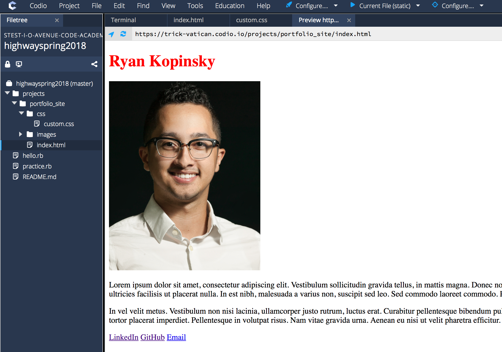

Now that we've confirmed that our CSS stylesheet is working, you can delete the test CSS that turned all `h1` elements red.

#### Margins

Our HTML content is too close to the edges of our page. Let's add margins to give it better spacing.

Your `custom.css` should look like:

```CSS
body {
  margin-top: 40px;
  margin-left: 60px;
  margin-right: 60px;
  margin-bottom: 40px;
}
```

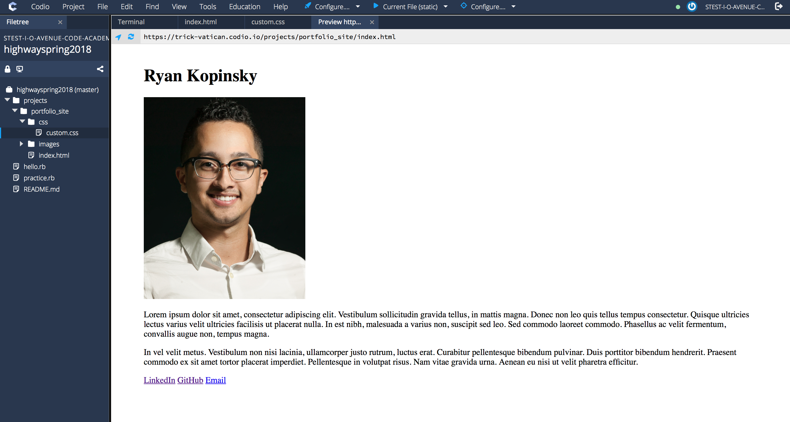

Our website looks much better already! Let's continue making improvements.

#### Sizing

Initially, we constrained the size of our headshot using an HTML attribute. However, the sizing of elements should really be done by applying a CSS style. Let's refactor our HTML. Update your headshot `img` tag as follows: ``. We gave our `img` tag an `id` attribute so we can reference it in our CSS. We also removed the `width` attribute.

Update your `custom.css` as follows:

```CSS
body {
  margin-top: 40px;
  margin-left: 60px;
  margin-right: 60px;
  margin-bottom: 40px;
}

#headshot {
  width: 300px; /* constrain the width */
  height: auto; /* height automatically calculated to maintain aspect ratio */
}
```

When refreshing your page, it will look like nothing changed. However, under the hood, we improved our code by using a CSS style to set the size of our headshot.

#### Layout

Updating the layout of our website, requires both modifications to our HTML and CSS. For this section, we want to position our bio and social links next to the headshot. Thus, we will `div`ide our content as follows:

```html
<!DOCTYPE html>
<html lang="en">
  <head>
    <meta charset="utf-8" />
    <meta name="viewport" content="width=device-width, initial-scale=1, shrink-to-fit=no"> <!-- responsive viewport meta tag -->

    <!-- Update your website title -->
    <title>Ryan Kopinsky</title>

    <!-- Link Bootstrap CSS here -->

    <!-- Link custom CSS here -->
    <link rel="stylesheet" type="text/css" href="css/custom.css">
  </head>
  <body>
    <!-- Add your content here -->
    <h1>Ryan Kopinsky</h1>

    <!-- Headshot -->
    <div id="headshotContainer">
      
    </div>

    <!-- About -->
    <div id="aboutContainer">
      <!-- Short Bio -->
      <p>Lorem ipsum dolor sit amet, consectetur adipiscing elit. Vestibulum sollicitudin gravida tellus, in mattis magna. Donec non leo quis tellus tempus consectetur. Quisque ultricies lectus varius velit ultricies facilisis ut placerat nulla. In est nibh, malesuada a varius non, suscipit sed leo. Sed commodo laoreet commodo. Phasellus ac velit fermentum, convallis augue non, tempus magna.</p>

      <p>In vel velit metus. Vestibulum non nisi lacinia, ullamcorper justo rutrum, luctus erat. Curabitur pellentesque bibendum pulvinar. Duis porttitor bibendum hendrerit. Praesent commodo ex sit amet tortor placerat imperdiet. Pellentesque in volutpat risus. Nam vitae gravida urna. Aenean eu nisi ut velit pharetra efficitur.</p>

      <!-- Social and Contact Links -->
      <a href="https://www.linkedin.com/in/ryankopinsky/" target="_blank">LinkedIn</a>
      <a href="https://github.com/ryankopinsky" target="_blank">GitHub</a>
      <a href="mailto:ryan@ioavenue.com">Email</a>
    </div>

    <!-- At the end of all your content, add Bootstrap JS here -->
  </body>
</html>
```

Notice we added two `div`s, each with their own `id` attribute so they can be referenced in our CSS stylesheet.

Recall that `div` elements are `block`line elements; each `div` goes on a new line. We actually want our `div`s to be `display`ed side-by-side. Thus we need to add some CSS to update the `display` attribute of our `div`s:

```CSS
body {
  margin-top: 40px;
  margin-left: 60px;
  margin-right: 60px;
  margin-bottom: 40px;
}

#headshot {
  width: 300px; /* constrain the width */
  height: auto; /* height automatically calculated to maintain aspect ratio */
}

#headshotContainer {
  display: inline-block;
}

#aboutContainer {
  display: inline-block;
}
```

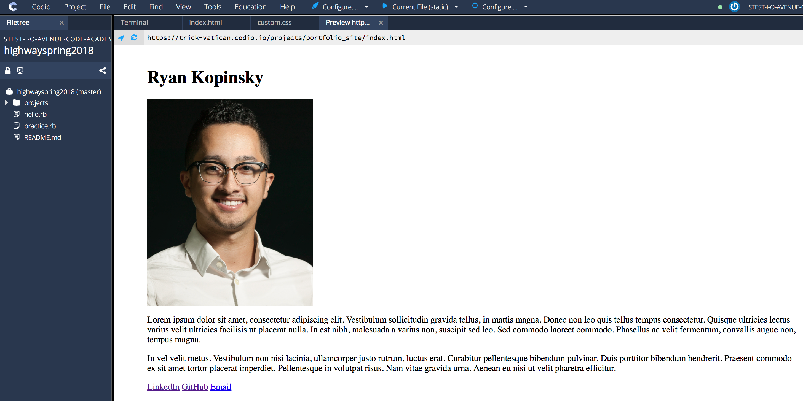

You may have noticed that nothing changed. Although our `div`s are now `inline-block` elements, they still take up the full width of the page. Thus, we need to adjust the `width`:

```CSS
body {
  margin-top: 40px;
  margin-left: 60px;
  margin-right: 60px;
  margin-bottom: 40px;
}

#headshot {
  width: 300px; /* constrain the width */
  height: auto; /* height automatically calculated to maintain aspect ratio */
}

#headshotContainer {
  display: inline-block;
  width: 30%;
}

#aboutContainer {
  display: inline-block;
  width: 70%;
}
```

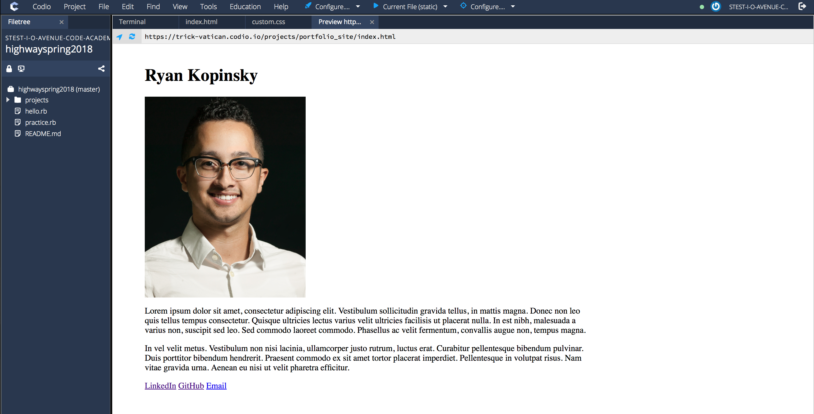

Although the `width` of our `div`s has been adjusted, they are still not side-by-side. This is where silly HTML and CSS quirks come into play. The `inline-block` `div` elements automatically have a margin of `4px`. Thus, if we give one `div` a `width` of `30%` of our page, and the other `70%`, there isn't enough space for the `div` elements **and** their margins. There are a few solutions to this issue. We can either reduce the `width` of each `div` or apply a negative `margin` to our `div`. Let's use the latter to fix our issue:

```CSS
body {
  margin-top: 40px;
  margin-left: 60px;
  margin-right: 60px;
  margin-bottom: 40px;
}

#headshot {
  width: 300px; /* constrain the width */
  height: auto; /* height automatically calculated to maintain aspect ratio */
}

#headshotContainer {
  display: inline-block;
  width: 30%;
  margin: -4px;
}

#aboutContainer {
  display: inline-block;
  width: 70%;
  margin: -4px;
}
```

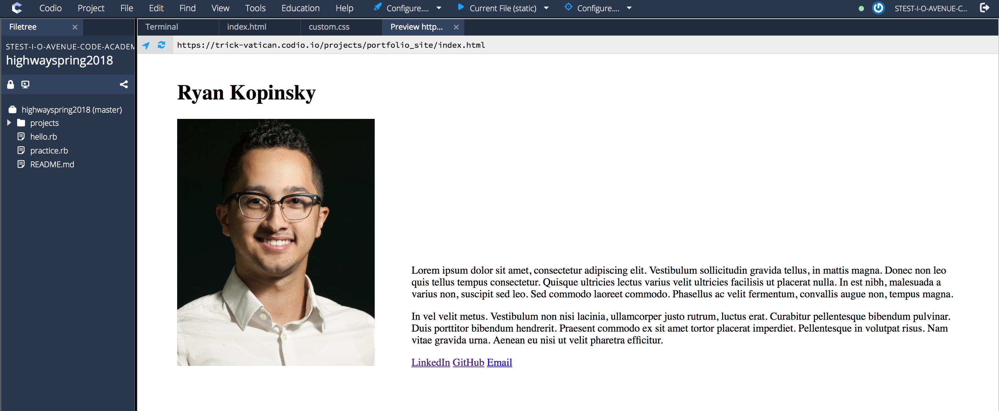

Now our content is side-by-side. However, our bio and social links seem to be vertically aligned to the bottom of the `div` container. Let's align our content to the top using: `vertical-align: top;`

```CSS
body {
  margin-top: 40px;
  margin-left: 60px;
  margin-right: 60px;
  margin-bottom: 40px;
}

#headshot {
  width: 300px; /* constrain the width */
  height: auto; /* height automatically calculated to maintain aspect ratio */
}

#headshotContainer {
  display: inline-block;
  width: 30%;
  margin: -4px;
}

#aboutContainer {
  display: inline-block;
  width: 70%;
  margin: -4px;
  vertical-align: top;
}
```

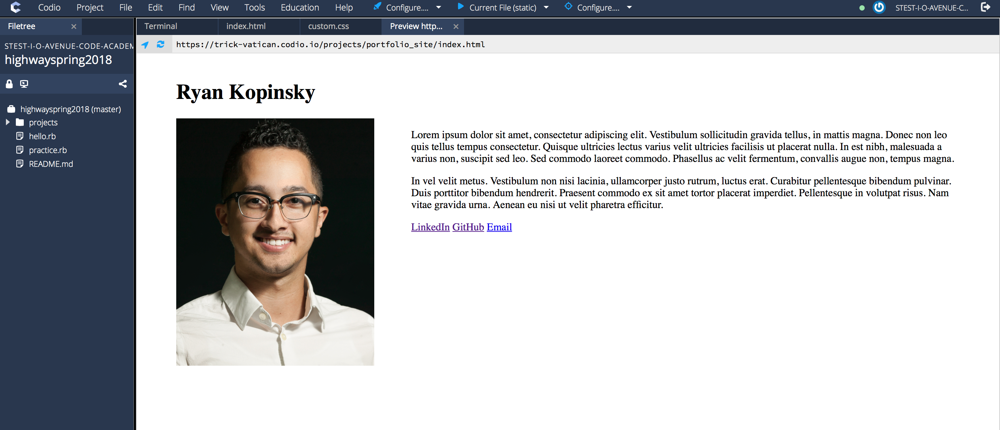

There we go! We are now done with adjusting the layout of our website.
