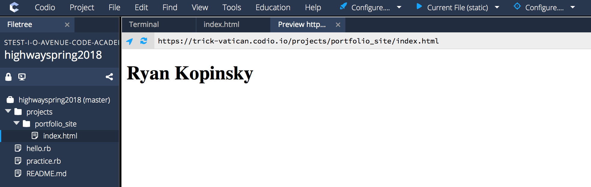

## **Phase 1**
In this tutorial, you will learn how to build your very own website using HTML, CSS and Bootstrap. In part 1 of this tutorial, we will build the site with just HTML. It won't be pretty, but it will work. In part 2, we will refactor our site by adding CSS to improve the appearance and layout. In part 3, we will demonstrate how the Bootstrap framework allows us to quickly build an awesome responsive site.

Throughout this example, we will build a portfolio website. The site requirements are as follows:
* A profile image of yourself  
* A short bio of yourself  
* Social and contact links (LinkedIn, Github, Email)   
* Projects (There must a way to link out to your projects whether they are live or on Github)   

### Part 1 - HTML

Let's get started with setting up our project:
1. In your `projects` folder, create a new folder: `$ mkdir portfolio_site`
1. `cd` into your `portfolio_site` directory
1. Create your first HTML file: `$ touch index.html`
1. Open the `index.html` file in your Codio text editor by selecting it in the Filetree. You are now ready to write some HTML!

There are several elements an HTML document should have to be considered valid HTML. To help you get started, copy-paste the following **HTML Starter Template** into `index.html`:

```html
<!DOCTYPE html>
<html lang="en">
  <head>
    <meta charset="utf-8" />
    <meta name="viewport" content="width=device-width, initial-scale=1, shrink-to-fit=no"> <!-- responsive viewport meta tag -->

    <!-- Update your website title -->
    <title>My Website</title>

    <!-- Link Bootstrap CSS here -->

    <!-- Link custom CSS here -->
  </head>
  <body>
    <!-- Add your content here -->

    <!-- At the end of all your content, add Bootstrap JS here -->
  </body>
</html>
```

Before we add content, let's make sure everything is working with a **Hello World** example. Add `<h1>Hello World</h1>` to `<body>`:

```html
...
  <body>
    <!-- Add your content here -->
    <h1>Hello World</h1>

    <!-- At the end of all your content, add Bootstrap JS here -->
  </body>
...
```

In order to test this HTML, go to your Codio Filetree and right-click on `index.html`. Select `Preview static`. A browser-like window will open in a new tab and you should see your webpage. Currently the page should only display Hello World. Anytime you add some new HTML, you can refresh this page to see the result.


#### Add Your Name

We are now ready to add content to our personal site. Update your site title to display your first and last name: `<title>Ryan Kopinsky</title>`. Also add an `h1` tag to display your name on the page: `<h1>Ryan Kopinsky</h1>`. Your `index.html` should look like:

```html
<!DOCTYPE html>
<html lang="en">
  <head>
    <meta charset="utf-8" />
    <meta name="viewport" content="width=device-width, initial-scale=1, shrink-to-fit=no"> <!-- responsive viewport meta tag -->

    <!-- Update your website title -->
    <title>Ryan Kopinsky</title>

    <!-- Link Bootstrap CSS here -->

    <!-- Link custom CSS here -->
  </head>
  <body>
    <!-- Add your content here -->
    <h1>Ryan Kopinsky</h1>

    <!-- At the end of all your content, add Bootstrap JS here -->
  </body>
</html>
```



#### Add Your Headshot

Let's continue adding content. As per the site requirements, we should now add a professional headshot. We can add an image by doing the following:
1. In your `portfolio_site` folder, create a new folder called `images`: `$ mkdir images`.
1. Upload your professional headshot (in either .PNG or .JPG format) by right-clicking on the newly-created `images` folder. Select `Upload` and use the dialog to upload your image.


1. Use an `img` tag to place the image on the webpage: ``.

Your `index.html` should look like:

```html
<!DOCTYPE html>
<html lang="en">
  <head>
    <meta charset="utf-8" />
    <meta name="viewport" content="width=device-width, initial-scale=1, shrink-to-fit=no"> <!-- responsive viewport meta tag -->

    <!-- Update your website title -->
    <title>Ryan Kopinsky</title>

    <!-- Link Bootstrap CSS here -->

    <!-- Link custom CSS here -->
  </head>
  <body>
    <!-- Add your content here -->
    <h1>Ryan Kopinsky</h1>

    

    <!-- At the end of all your content, add Bootstrap JS here -->
  </body>
</html>
```


Oops! That image is way too big (the original image is 1000px wide and 1250px high). We can constrain its size by providing a `height` and/or `width` attribute. It is important to note that you always want to maintain the image's aspect ratio (so it doesn't looked squished). Thus, when providing size constraints, provide either a value for `height` or `width`. The other value will automatically be calculated for you to maintain the image's aspect ratio: ``.

Your `index.html` should look like:

```html
<!DOCTYPE html>
<html lang="en">
  <head>
    <meta charset="utf-8" />
    <meta name="viewport" content="width=device-width, initial-scale=1, shrink-to-fit=no"> <!-- responsive viewport meta tag -->

    <!-- Update your website title -->
    <title>Ryan Kopinsky</title>

    <!-- Link Bootstrap CSS here -->

    <!-- Link custom CSS here -->
  </head>
  <body>
    <!-- Add your content here -->
    <h1>Ryan Kopinsky</h1>

    

    <!-- At the end of all your content, add Bootstrap JS here -->
  </body>
</html>
```


Much better!

#### Add Your Short Bio

Your bio should tell the story of you. Who are you, what is your background, what are your (technical) skills, what are your goals and interests etc.

For phase 1 of your personal site, write 1 to 2 short paragraphs for your bio. This tutorial will use sample text generated at https://www.lipsum.com. You should use your actual bio!

You can add your bio content as paragraph text using the `p` tag. Your `index.html` should look like:

```html
<!DOCTYPE html>
<html lang="en">
  <head>
    <meta charset="utf-8" />
    <meta name="viewport" content="width=device-width, initial-scale=1, shrink-to-fit=no"> <!-- responsive viewport meta tag -->

    <!-- Update your website title -->
    <title>Ryan Kopinsky</title>

    <!-- Link Bootstrap CSS here -->

    <!-- Link custom CSS here -->
  </head>
  <body>
    <!-- Add your content here -->
    <h1>Ryan Kopinsky</h1>

    

    <p>Lorem ipsum dolor sit amet, consectetur adipiscing elit. Vestibulum sollicitudin gravida tellus, in mattis magna. Donec non leo quis tellus tempus consectetur. Quisque ultricies lectus varius velit ultricies facilisis ut placerat nulla. In est nibh, malesuada a varius non, suscipit sed leo. Sed commodo laoreet commodo. Phasellus ac velit fermentum, convallis augue non, tempus magna.</p>

    <p>In vel velit metus. Vestibulum non nisi lacinia, ullamcorper justo rutrum, luctus erat. Curabitur pellentesque bibendum pulvinar. Duis porttitor bibendum hendrerit. Praesent commodo ex sit amet tortor placerat imperdiet. Pellentesque in volutpat risus. Nam vitae gravida urna. Aenean eu nisi ut velit pharetra efficitur.</p>

    <!-- At the end of all your content, add Bootstrap JS here -->
  </body>
</html>
```


