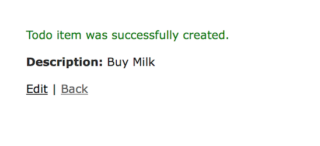

# Build a ToDo List App using Rails Scaffolding

# Objectives
After successful completion of this project, you will be able to:
- create a new rails app from the command line
- generate a rails scaffold from the command line
- use rake:db migrate to migrate models
- run a rails server and view an app on localhost
- use rake routes to see the routes created by the scaffold
- describe the different routes created and there functions, as well as what resources means in regards to routes
- describe what a before action is and when it is executed
- use erb to edit the view generated by the scaffold
- destroy a scaffold

# Problem Statement
Assume that you work for a company that paid to send you to I/O Avenue. You just received an urgent email from your project manager:

---

Junior Dev,

We’re all excited about the progress you’ve made so far. Things are going very well.

I told the boss that you’d only need a month to ramp up on Ruby and Rails. I hear there have been some delays in that schedule. We were expecting you to be done picking up Rails by now.

The boss just checked in with me and now he wants to see some results.

I know you haven't really started learning how to build a site with Rails, but we’d like to see a working web app by next Monday. I realize that it’s very short notice, but the boss wants to be able to report some ROI to the board for his quarterly report.

Create a simple ToDo List webapp. It doesn’t have to look pretty, but it should work.

Thanks for all your hard work,

PM

---

Well that sucks.

So… how hard can it be to create a website in Rails? If someone asked you to create a full-stack ToDo List web application, including HTML, CSS, JavaScript, Ruby, and a database, how much time would you quote them?

A week?  Two weeks?

We’ve got **one weekend**.

Fortunately, the instructors at I/O Avenue aren't heartless. They've written up this awesome guide to help you get through the project. Let's get to work!

# Step-by-Step Instructions

Create a `project_5` folder in your `projects` folder. Then, start a new Rails app.

```
$ mkdir projects/project_5
$ cd projects/project_5
$ rails new todo
$ cd todo
```

Note: Rails automatically initializes git when creating a new project. Thus, you do not need to do `$ git init`. To verify, there should be a `.git` folder in `/todo`.

---

What we need to create is called a scaffold. What’s that? Execute `$ rails g scaffold`:

```
Usage:
  rails generate scaffold NAME [field[:type][:index] field[:type][:index]] [options]
...
Description:
    Scaffolds an entire resource, from model and migration to controller and
    views, along with a full test suite. The resource is ready to use as a
    starting point for your RESTful, resource-oriented application.
...
```

This sounds like exactly what we need. A whole webapp, model, migration, controller, and views - all in one command.

Take a few moments to think about what a ToDo list item should have or look like. At a minimum, it should have description.

Let's create a ToDo list item with a description: `$ rails g scaffold todo_item description:string --javascript-engine=js--stylesheet-engine=css`

```
Running via Spring preloader in process 3782
      invoke  active_record
      create    db/migrate/20171101211821_create_todo_items.rb
      create    app/models/todo_item.rb
      invoke    test_unit
      create      test/models/todo_item_test.rb
      create      test/fixtures/todo_items.yml
      invoke  resource_route
       route    resources :todo_items
      invoke  scaffold_controller
      create    app/controllers/todo_items_controller.rb
      invoke    erb
      create      app/views/todo_items
      create      app/views/todo_items/index.html.erb
      create      app/views/todo_items/edit.html.erb
      create      app/views/todo_items/show.html.erb
      create      app/views/todo_items/new.html.erb
      create      app/views/todo_items/_form.html.erb
      invoke    test_unit
      create      test/controllers/todo_items_controller_test.rb
      invoke    helper
      create      app/helpers/todo_items_helper.rb
      invoke      test_unit
      invoke    jbuilder
      create      app/views/todo_items/index.json.jbuilder
      create      app/views/todo_items/show.json.jbuilder
      create      app/views/todo_items/_todo_item.json.jbuilder
      invoke  test_unit
      create    test/system/todo_items_test.rb
      invoke  assets
       error    js--stylesheet-engine=css [not found]
      invoke    scss
      create      app/assets/stylesheets/todo_items.scss
      invoke  scss
      create    app/assets/stylesheets/scaffolds.scss
```

By default, Rails prefers that I use CoffeeScript and SCSS, but we haven’t learned that, so we told Rails to scaffold some plain JavaScript and CSS for us instead (via the options).

---

This generator creates a whole bunch of stuff. Let’s check the migration. In `db/migrate/20171101211821_create_todo_items.rb` you should see:

```
class CreateTodoItems < ActiveRecord::Migration[5.1]
  def change
    create_table :todo_items do |t|
      t.string :description

      t.timestamps
    end
  end
end
```

Seems to make sense. Let's run the migration (i.e. update the database) `$ rake db:migrate`.

```
== 20171101211821 CreateTodoItems: migrating ===========================
=======
-- create_table(:todo_items)
   -> 0.0011s
== 20171101211821 CreateTodoItems: migrated (0.0012s) ==================
=======
```

---

When we load up the server (with `$ rails s`), we should now see the default homepage.

Where’s our scaffold located? Let’s check the routes. In `config/routes.rb`:

```
Rails.application.routes.draw do
  resources :todo_items
end
```

The scaffold generator added a route for us. But it’s a weird one. It just says “resources”. Let's find out what this means: `$ rake routes`

```
Prefix Verb           URI Pattern                    Controller#Action
todo_items GET        /todo_items(.:format)          todo_items#index
           POST       /todo_items(.:format)          todo_items#create
new_todo_item GET     /todo_items/new(.:format)      todo_items#new
edit_todo_item GET    /todo_items/:id/edit(.:format) todo_items#edit
todo_item GET         /todo_items/:id(.:format)      todo_items#show
          PATCH       /todo_items/:id(.:format)      todo_items#update
          PUT         /todo_items/:id(.:format)      todo_items#update
          DELETE      /todo_items/:id(.:format)      todo_items#destroy
```

The rake routes task shows us a list of all the routes defined in `config/routes.rb`. We get a lot of stuff from that one line of code. What `resources` does is define a RESTful resource. Just like we learned, a RESTful resource follows a particular pattern.

```
GET /todo_items
Gets the list of all todos.

GET /todo_items/:id
Gets a single todo.

POST /todo_items
Creates a new todo.

PUT (or PATCH) /todo_items/:id
Updates a single todo.

DELETE /todo_items/:id
Deletes a single todo.
```

The above was generated automatically by declaring that a TodoItem is a “resource”.

---

Let’s start up the server and navigate to `http://<box-name>.codio.io:3000/todo_items`.


Rails made a complete webapp for us, with multiple pages and links. For example, we can create a new todo by navigating to `http://<box-name>.codio.io:3000/todo_items/new`.


Enter a description and click the `Create Todo item` button:



We can go back to our `/todo_items` URL and we should now see:


And we can now view (aka show), edit, and destroy (aka delete) my todos.

---

The controller that Rails generated for us is pretty impressive. Check it out for yourself. There are `index`, `show`, `new`, `edit`, `create`, `update`, and `destroy` methods (called “actions”). There are private methods (at the bottom). There’s even a `before_action` at the top:

```
before_action :set_todo_item, only: [:show, :edit, :update, :destroy]
```

`before_action` tells Rails to run the private `set_todolist` method before running any of the actions listed. And all that method does is set an instance variable, in this case `@todo_item`.

In fact, most of these methods just set instance variables: index, show, new, edit

The bigger methods (create, update, destroy) all do one thing, then use a big respond_to to render HTML or JSON.

Navigate to `http://<box-name>.codio.io:3000/todo_items.json`

```
[{"id":1,"description":"Buy Milk","created_at":"2017-11-01T22:19:58.478Z","updated_at":"2017-11-01T22:19:58.478Z","url":"http://compact-lima.codio.io:3000/todo_items/1.json"}]
```

By adding “.json” to the end of the URL, we can get a JSON version of our ToDo list.

---

Where are all these views defined? In the views folder of course. `$  ls app/views/todo_items/`

```
edit.html.erb   index.json.jbuilder  show.json.jbuilder
_form.html.erb  new.html.erb         _todo_item.json.jbuilder
index.html.erb  show.html.erb
```

There is a view for each controller action that needs it: `index`, `new`, `show`, and `edit`. Some actions (`index` and `show`) have two views, one for HTML and another for JSON. That means I can get JSON for all my todos (`index`) or a single todo (`show`).

Let’s take a look at `app/views/todo_items/show.html.erb`:

```
<p id="notice"><%= notice %></p>

<p>
  <strong>Description:</strong>
  <%= @todo_item.description %>
</p>

<%= link_to 'Edit', edit_todo_item_path(@todo_item) %> |
<%= link_to 'Back', todo_items_path %>
```

All the code needed to show a single `todo_item` is in the `show` view. It’s written in HTML, but some of the tags look weird. That’s because this file is in ERB format. All the tags that start with `<%=` and end with `%>` contain Ruby code. This Ruby code uses the variables we set in our controller actions.

The `show` controller only does this:
``@todo_item = TodoItem.find(params[:id])``

That same instance variable (`@todo_item`) appears in the corresponding view. The interaction between the controller and the view is as simple as that. The controller sets some instance variables (variables that begin with @), and the view uses them.

---
